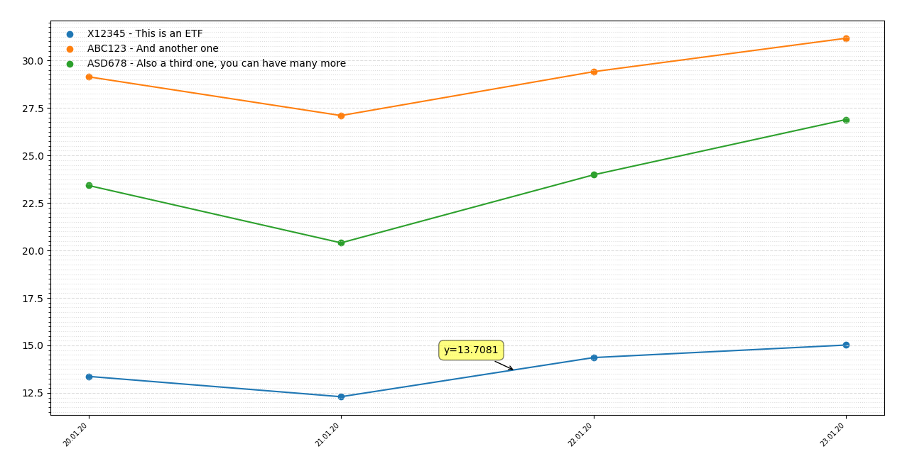

# ETF plotter



I store the prices of several ETF I am tracking in a markdown file. The file has this Format:

```
### 20.01.20

X12345 This is an ETF EUR 13,37
ABC123 And another one   EUR 29,14
ASD678 Also a third one, you can have many more EUR 23,42

### 21.01.20

X12345 This is an ETF EUR 12,30
ABC123 And another one   EUR 27,10
ASD678 Also a third one, you can have many more EUR 20,40
```

So basically `###` followed by space and a date, then the price of one ETF after another, using the format

```
[Identifier_like_ISIN_OR_WKN_no_spaces] [A Name that can have spaces and words and stuff] EUR [price with , not . b/c that's how we do it here]
```

The script will parse the file, create a data structure with dates and prices and will use `matplotlib` to plot them.

## Run it

```
./etfplot.py /path/to/md/file
```

## Dependencies

You will need

 - matplotlib
 - [mplcursors](https://github.com/anntzer/mplcursors)
